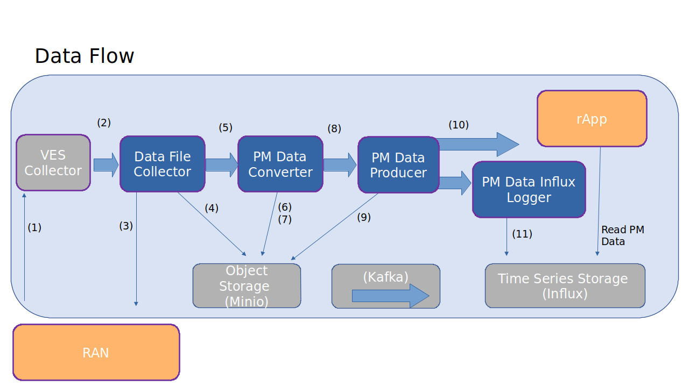

* The RAN node sends a VES event with available PM measurement report files.

* The VES event is put on a Kafka topic and picked up by the Data File Collector.

* A PM report file is fetched from the RAN node by a file transfer protocol. Which protocol to use is defined in the VES event.

* The collected file is stored

* A File collected object is put on a Kafka topic and is picked up by the PM File Converter.

* The file data is read from the file store.

* A PM report in json format is stored (compressed with gzip).

* A message (a Json object) indicating that a new PM report (in Json format) is available is put on a Kafka topic and is picked up by the PM Data Producer.

* The PM data producer reads the Json file

* The subscribed PM data is sent to the PM data consumers (over Kafka). An rApp may be a PM data consumer.

* The Influx Logger, which is a PM data consumer, stores PM data in an Influx database.