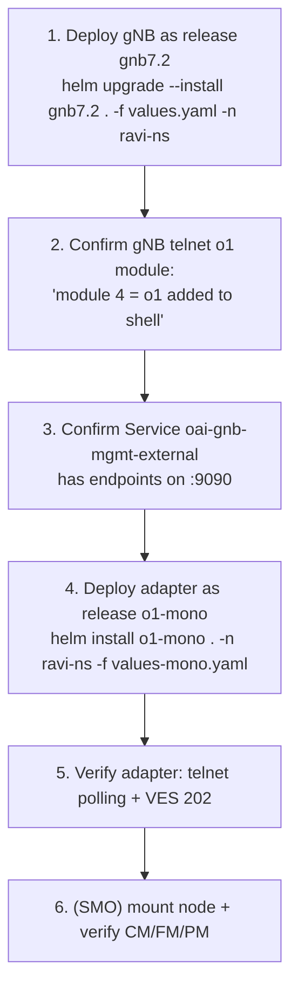

# OAI gNB (`gnb7.2`) + O1-Adapter (`o1-mono`) — Deployment, Verification & Lifecycle

**Purpose.** A practical, copy-paste deployment guide for bringing up the
monolithic OAI gNB and its O1-Adapter as Helm releases, in the correct order,
with the exact release names that make the wiring work — plus verification of
the gNB and adapter logs, and clean uninstall. This is the operational
companion to Files 1–3 (which cover image build, config, and the PM→InfluxDB
pipeline). Everything here reflects the actual working bring-up.

The two deployments, at a glance:

```bash
# gNB — the release name MUST be gnb7.2 (explained in §2)
helm upgrade --install gnb7.2 . -f values.yaml -n ravi-ns

# O1 adapter — monolithic values file
helm install o1-mono . -n ravi-ns -f values-mono.yaml
```

---

## 1. Why order and names matter (read this first)

Two naming facts caused real, time-consuming failures during bring-up. Getting
them right up front avoids the whole debugging loop.

1. **The gNB Helm release name must be `gnb7.2`.** The gNB's management Service
   `oai-gnb-mgmt-external` selects pods by the label
   `app.kubernetes.io/instance=gnb7.2`. Helm sets that label from the **release
   name**. Deploy under any other name and the Service selector no longer
   matches the gNB pod → the Service has **no endpoints** → the adapter's telnet
   client gets **"Connection refused"** and never reads `o1 stats`. This is the
   single most important naming rule here.

2. **Deploy the gNB first, the adapter second.** The adapter immediately tries
   to telnet the gNB (`oai-gnb-mgmt-external...:9090`). If the gNB (and its
   Service endpoints) isn't up yet, the adapter starts erroring on telnet.
   Bring the gNB fully up, confirm the O1 telnet module loaded and the Service
   has endpoints, then deploy the adapter.



---

## 2. Deploy the gNB (`gnb7.2`)

### 2.1 The command

```bash
cd ~/oai-helm-templates/oai-5g-ran/oai-gnb-fhi-72     # your gNB chart dir
helm upgrade --install gnb7.2 . -f values.yaml -n ravi-ns
```

`upgrade --install` is idempotent — it installs if `gnb7.2` doesn't exist, and
upgrades in place if it does. Keep the release name exactly `gnb7.2`.

### 2.2 What `values.yaml` must contain

The gNB must launch with the O1 telnet flags. The chart consumes them via the
`USE_ADDITIONAL_OPTIONS` env, wired from `config.useAdditionalOptions`:

```yaml
useAdditionalOptions: "--telnetsrv --telnetsrv.shrmod o1 --telnetsrv.listenport 9090 --log_config.global_log_options level,nocolor,time"
```

Also ensure the O1-capable gNB image tag is set (e.g. `2026.w30-o1` or
`2026.w28-patched`) — the image that ships `libtelnetsrv_o1.so`.

### 2.3 Verify the gNB came up with O1 telnet

```bash
# pod running?
kubectl -n ravi-ns get pods -l app.kubernetes.io/instance=gnb7.2 -o wide

# the O1 telnet module loaded + flags reached the binary
kubectl -n ravi-ns logs <gnb-pod> -c gnb | grep -iE 'CMDLINE|module 4 = o1'
```

**Success looks like (real output):**

```text
CMDLINE: "/opt/oai-gnb/bin/nr-softmodem" "-O" "/tmp/gnb.yaml" "--telnetsrv" "--telnetsrv.shrmod" "o1" ...
[TELNETSRV] Telnet server: module 4 = o1 added to shell
```

`module 4 = o1 added to shell` is the line that matters. (A
`libtelnetsrv_gnb.so is not loaded` warning is harmless — that per-app module is
optional.)

Confirm the cell and internal F1 are up (real output):

```text
[GNB_APP] F1AP: gNB idx 0 gNB_DU_id 3602, gNB_DU_name oai-gnb-00, TAC 1 MCC/MNC/length 1/1/2 cellID 1
[NR_RRC]  Received F1 Setup Request from gNB_DU 3602 ... sending F1 Setup Response
```

### 2.4 Verify the telnet Service has endpoints (the critical check)

```bash
kubectl -n ravi-ns get endpoints oai-gnb-mgmt-external
```

- **Good:** lists `<gnb-pod-ip>:9090` (and `:1830`).
- **Bad:** `<none>` → the selector is stale. This is the `gnb7.2`-name issue —
  redeploy the gNB under release name `gnb7.2` (or patch the Service selector to
  match your release). Until this shows endpoints, the adapter cannot telnet the
  gNB.

---

## 3. Deploy the O1-Adapter (`o1-mono`)

### 3.1 The command

```bash
cd ~/oai-o1-adapter-helm-templates
helm install o1-mono . -n ravi-ns -f values-mono.yaml
```

Use `helm install` for the first deploy; use `helm upgrade o1-mono . -n ravi-ns
-f values-mono.yaml` for subsequent config changes (see §6). The deploy is
**file-driven** — put everything in `values-mono.yaml`, avoid `--set` in
production so the release is reproducible.

### 3.2 What the install echoes (wiring confirmation)

A successful install prints the wiring summary — check these match your intent
(real output):

```text
NAME: o1-mono
STATUS: deployed
...
Wiring summary:
  gNB telnet (south) : oai-gnb-mgmt-external.ravi-ns.svc.cluster.local:9090
  SMO reaches NETCONF: 192.168.206.106:1830  (service type LoadBalancer)
  SMO reaches SFTP   : 192.168.206.106:1222
  VES collector (out): http://192.168.8.69:30417/eventListener/v7
```

The telnet line shows the **ClusterIP DNS name** (not a NodePort) — that's the
proven path; the NodePort (`192.168.206.82:30090`) times out.

### 3.3 Key fields the pod relies on (from `values-mono.yaml`)

| Field | Value | Why |
|---|---|---|
| `image.tag` | `main-v1` | mainline adapter build (monolithic); not the KPM build |
| `telnet.host` / `port` | `oai-gnb-mgmt-external.ravi-ns.svc.cluster.local` / `9090` | ClusterIP DNS → gNB `:9090`; must equal the gNB's `--telnetsrv.listenport` |
| `smo.advertisedHost` + `service.loadBalancerIP` | `192.168.206.106` | advertised in pnfRegistration; SDNC dials back to it |
| `nodeSelector` / `tolerations` | `joule` / `dedicated=5g-radio` | pin to the radio node without disturbing the gNB's QoS |
| `info.node-id` | `oai-gnb-mono` | distinct SMO identity |
| `info.gnb-du-id` / `cell-local-id` | `3602` / `1` | match the gNB's F1 `gNB_DU_id 3602`, `cellID 1` |
| `info.granularityPeriod` / `fileReportingPeriod` | `0` / `0` | **required** by the adapter config parser (else startup aborts) |

### 3.4 Confirm placement + LoadBalancer

```bash
kubectl -n ravi-ns get pods -l app.kubernetes.io/instance=o1-mono -o wide
kubectl -n ravi-ns get svc  -l app.kubernetes.io/instance=o1-mono
```

**Real output:**

```text
NAME                                      READY  STATUS   NODE   IP
o1-mono-oai-o1-adapter-64b6b75bf6-gfqhn   1/1    Running  joule  172.16.241.241

SERVICE                  TYPE          EXTERNAL-IP      PORT(S)
o1-mono-oai-o1-adapter   LoadBalancer  192.168.206.106  1830:31883/TCP,1222:31999/TCP
```

---

## 4. Verify the adapter logs (the moment of truth)

```bash
kubectl -n ravi-ns logs deploy/o1-mono-oai-o1-adapter --tail=40 -f
```

**Success looks like (real output):**

```text
"reportingEntityName": "ManagedElement=oai-gnb-mono",
"sourceId": "3602",
"sourceName": "oai-gnb-mono",
"nfVendorName": "OpenAirInterface",
"vesEventListenerVersion": "7.2.1"
...
[ves/ves_internal.c : 129] response_code = 202
[ves/ves_internal.c : 131] response = Successfully send event
[telnet/telnet.c    : 498] telnet_write('o1 stats')
[telnet/telnet.c    : 498] telnet_write('o1 stats')
```

Two things prove success:

- **`response_code = 202` / `Successfully send event`** — the SMO VES collector
  accepted the adapter's pnfRegistration / heartbeat.
- **Steady `telnet_write('o1 stats')` with no parse error** — the adapter is
  polling and parsing the gNB cleanly. In particular there is **no**
  `not found: nrcelldu3gpp:cellLocalId` line (that error means the wrong adapter
  branch was built — the KPM build instead of mainline).

### 4.1 Quick reachability sanity (northbound, from the SMO)

```bash
# on the SMO host (zhongkui)
nc -vz 192.168.206.106 1830      # -> succeeded!
nc -vz 192.168.206.106 1222      # -> succeeded!

# from inside SDNC (proves the ONAP->RAN path, not just the shell)
kubectl -n onap exec onap-sdnc-0 -- \
  bash -lc "timeout 5 bash -c '</dev/tcp/192.168.206.106/1830' && echo OK || echo FAIL"
# -> OK
```

(CM mount + YANG resolution + PM→InfluxDB verification are covered in Files 2
and 3; this guide stops at "adapter healthy and talking to the SMO.")

---

## 5. Combined bring-up sequence (copy-paste)

```bash
NS=ravi-ns

# --- gNB ---
cd ~/oai-helm-templates/oai-5g-ran/oai-gnb-fhi-72
helm upgrade --install gnb7.2 . -f values.yaml -n $NS

kubectl -n $NS get pods -l app.kubernetes.io/instance=gnb7.2 -o wide
kubectl -n $NS logs <gnb-pod> -c gnb | grep -iE 'CMDLINE|module 4 = o1'
kubectl -n $NS get endpoints oai-gnb-mgmt-external      # must NOT be <none>

# --- adapter ---
cd ~/oai-o1-adapter-helm-templates
helm install o1-mono . -n $NS -f values-mono.yaml

kubectl -n $NS get pods -l app.kubernetes.io/instance=o1-mono -o wide
kubectl -n $NS logs deploy/o1-mono-oai-o1-adapter --tail=40 -f
# look for: 202 / Successfully send event, and steady telnet_write('o1 stats')
```

---

## 6. Lifecycle — logs, restart, config change, uninstall

```bash
NS=ravi-ns
GNB=gnb7.2
ADP=o1-mono
DEP=deploy/o1-mono-oai-o1-adapter
GCHART=~/oai-helm-templates/oai-5g-ran/oai-gnb-fhi-72
ACHART=~/oai-o1-adapter-helm-templates

# ---------- status ----------
helm list -n $NS
kubectl -n $NS get pods -o wide | grep -iE 'gnb|o1-mono'

# ---------- logs ----------
kubectl -n $NS logs <gnb-pod> -c gnb -f
kubectl -n $NS logs $DEP -f
kubectl -n $NS logs $DEP --tail=60 | grep -iE 'response_code|telnet_write|error|not found'

# ---------- restart ----------
kubectl -n $NS rollout restart $DEP            # adapter
kubectl -n $NS rollout restart deploy/<gnb-deploy-name>   # gNB (name per your chart)

# ---------- stop / start (adapter) ----------
kubectl -n $NS scale $DEP --replicas=0         # stop
kubectl -n $NS scale $DEP --replicas=1         # start

# ---------- apply a config change (file-driven) ----------
helm upgrade $ADP $ACHART -n $NS -f values-mono.yaml    # adapter
helm upgrade --install $GNB $GCHART -n $NS -f values.yaml   # gNB

# ---------- uninstall ----------
helm uninstall $ADP -n $NS        # remove the adapter first
helm uninstall $GNB -n $NS        # then the gNB
helm list -n $NS                  # confirm both gone

# ---------- reinstall (fresh) ----------
helm upgrade --install $GNB $GCHART -n $NS -f values.yaml
helm install $ADP $ACHART -n $NS -f values-mono.yaml
```

**Uninstall order:** remove the adapter (`o1-mono`) before the gNB (`gnb7.2`).
The adapter depends on the gNB's telnet Service; removing the gNB first just
makes the adapter error until it too is removed. On uninstall, Helm deletes the
release's Deployment, Service, ConfigMap, and (for the adapter) releases the
MetalLB `.106`. The `.106` binding on `joule`'s `eno12399` is **not** managed by
Helm — it persists (that's intentional; it's in the systemd `o1-ip-bypass`
unit).

> **Known adapter quirk (per OAI docs):** if the node doesn't appear on the SMO
> after deploy, `rollout restart` the adapter — a second pnfRegistration is
> sometimes needed.

---

## 7. Troubleshooting (deployment-specific)

| Symptom | Root cause | Fix |
|---|---|---|
| adapter telnet **"Connection refused"** | gNB Service `oai-gnb-mgmt-external` has no endpoints (selector `instance=gnb7.2` stale) | deploy gNB as release **`gnb7.2`**; confirm `get endpoints` is non-empty |
| adapter telnet **"Connection timed out"** | using the NodePort path `192.168.206.82:30090` | set `telnet.host` to the ClusterIP DNS `oai-gnb-mgmt-external.ravi-ns.svc.cluster.local`, port `9090` |
| gNB `CMDLINE` lacks `--telnetsrv` | `useAdditionalOptions` not wired to the env | ensure `USE_ADDITIONAL_OPTIONS` is set from values; redeploy |
| gNB log has no `module 4 = o1` | image lacks `libtelnetsrv_o1.so` | use the O1-capable image tag (`2026.w30-o1`); rebuild if needed (File 1) |
| adapter log `not found: nrcelldu3gpp:cellLocalId` | built from the **KPM** adapter branch (`08f208b`) vs monolithic gNB | deploy the **mainline** build (`main-v1`, commit `ce13992`) |
| adapter startup aborts `config json parser error: granularityPeriod` | required `info` fields missing | add `granularityPeriod` + `fileReportingPeriod` to `values-mono.yaml` |
| adapter pod `Pending` on joule | radio taint not tolerated | add toleration `dedicated=5g-radio:NoSchedule` |
| SVC has no `EXTERNAL-IP` | MetalLB `.106` not free / not in pool | free `.106` in `smo-management-pool`; confirm it's bound on `joule eno12399` |
| SMO can't reach `.106:1830` | `.106` not bound on `joule eno12399` (dropped on reboot) | re-add the binding; persist via the systemd unit |

---

## 8. Summary

- **gNB:** `helm upgrade --install gnb7.2 . -f values.yaml -n ravi-ns` — the
  release name **must** be `gnb7.2` so `oai-gnb-mgmt-external` selects the pod;
  verify `module 4 = o1 added to shell` and that the Service has endpoints.
- **Adapter:** `helm install o1-mono . -n ravi-ns -f values-mono.yaml` — deploy
  **after** the gNB; verify VES `202` + steady `telnet_write('o1 stats')` with no
  `cellLocalId` error.
- **Order:** gNB → confirm endpoints → adapter. **Uninstall:** adapter → gNB.
- The whole first-time failure was the gNB deployed under the wrong release
  name, so the telnet Service had no endpoints and the adapter couldn't connect —
  deploying as `gnb7.2` is the fix, and the ClusterIP DNS telnet target (not the
  NodePort) is the reliable transport.