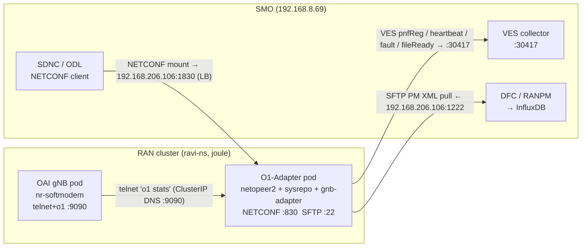
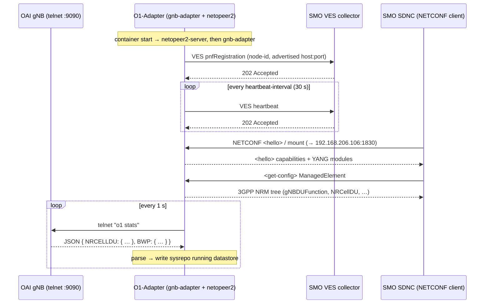
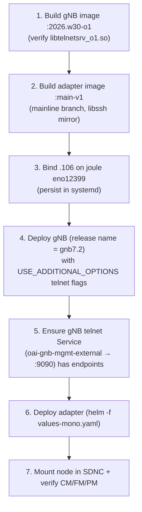
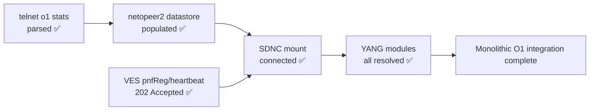
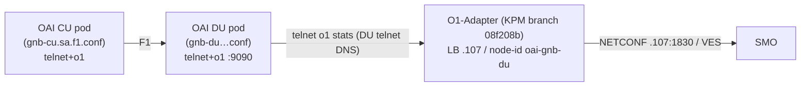

# Integrating the OAI O1-Adapter with an OAI gNB on a Kubernetes O-Cloud
---

## 1. Abstract

The O1 interface is the management plane of the O-RAN architecture: it carries
configuration management (CM), fault management (FM), and performance management
(PM) between a network function and the Service Management and Orchestration
framework (SMO). OpenAirInterface (OAI) does not implement a NETCONF/YANG stack
inside the gNB itself; instead it ships a separate **O1-Adapter** that bridges
the gNB (queried over a lightweight *telnet* control channel) to the SMO
(served over *NETCONF* + *VES*). This document records a complete, working
integration of that adapter with a monolithic OAI gNB in a disaggregated
Kubernetes O-Cloud, including every build, configuration, and deployment step,
the reasoning behind the design choices, and the verification evidence.

---

## 2. System architecture

### 2.1 Testbed topology

| Host / node | Address | Role |
| --- | --- | --- |
| `oai-ran` KVM | `192.168.8.78` | build host (Docker), gNB launch host |
| `joule` | `192.168.206.82` | StarlingX O-Cloud worker (radio node), runs gNB + adapter pods |
| `worker-1` | (cluster CNI) | generic O-Cloud worker |
| SMO / SDNC / VES / InfluxDB | `192.168.8.69` (a.k.a. `zhongkui`) | ONAP-based SMO |
| Galileo | `192.168.8.35` | NAT gateway between `192.168.8.x` and `192.168.206.x` |

`joule` is the radio node: it is labelled `specialized=radio`,
`dpdk=enabled`, `kube-topology-mgr-policy=restricted`, and tainted
`dedicated=5g-radio:NoSchedule`. The gNB pod runs there with Guaranteed QoS and
static CPU pinning for NUMA locality.

### 2.2 Where the adapter runs, and why

The adapter is deployed as **its own Deployment in the RAN cluster**
(`ravi-ns`), pinned to `joule`, **not** as a sidecar in the gNB pod and **not**
on the SMO host. Rationale:

- **Not a sidecar** — the gNB pod is Guaranteed QoS with static CPU pinning; QoS
  is per-pod, so co-locating the adapter container would drop the whole pod out
  of Guaranteed and break the DU's NUMA core isolation.
- **Not on the SMO host** — the adapter is a RAN *managed element* (it
  represents the gNB southbound). It belongs with the RAN.
- **A separate pod on `joule`** — no radio/NUMA cores needed (it is a ~1 Hz
  telnet poller); it shares the node harmlessly as a Burstable pod.

### 2.3 O1 data paths



Key address decisions (each hard-won):

- **Southbound telnet** uses the gNB's **ClusterIP service DNS name**
  (`oai-gnb-mgmt-external.ravi-ns.svc.cluster.local:9090`), *not* a NodePort.
  NodePort `192.168.206.82:30090` timed out; the ClusterIP DNS path is reliable
  and survives gNB pod restarts / IP changes.
- **Northbound NETCONF/SFTP** is exposed via a **MetalLB LoadBalancer** on
  `192.168.206.106` (ports 1830/1222 → container 830/22). This IP is bound on
  `joule`'s `eno12399` (the O1 bypass) so the SMO subnet can route to it.
  `192.168.206.106` is the **advertised host** in `config.json` and in
  pnfRegistration — SDNC dials *back into it* to mount.
- OCUDU already owns `192.168.206.105`; the OAI adapter must use a **distinct**
  IP (`.106`) and a **distinct** `node-id` to avoid collisions.

---

## 3. How the OAI O1-Adapter works

Reference: the adapter README, `https://gitlab.eurecom.fr/oai/o1-adapter`.

### 3.1 The adapter *is* the NETCONF server (no separate component)

Unlike the OCUDU architecture — where a **separate** `netconf-server` container
is deployed alongside the adapter — the OAI O1-Adapter **bundles the entire
NETCONF stack inside one container**:

- **netopeer2-server** — NETCONF connectivity (started `-t 60`)
- **sysrepo** — the YANG datastore
- the installed 3GPP + IETF YANG models
- **gnb-adapter** — the binary that polls the gNB and services NETCONF

So no external NETCONF service is required. One adapter container = the full O1
endpoint the SMO mounts. (A second NETCONF container would collide on port 830.)

### 3.2 The telnet ↔ NETCONF/VES bridge

The adapter is a **telnet-to-NETCONF/VES bridge**, not an in-process gNB module:

- **Southbound:** the gNB softmodem runs a telnet server with the O1 telnet
  extension (`--telnetsrv --telnetsrv.shrmod o1 --telnetsrv.listenport 9090`).
  The `gnb-adapter` binary is a telnet *client*; once per second it issues
  `o1 stats`, receives a JSON blob, and parses it into the YANG datastore.
- **Northbound (CM/FM):** netopeer2 serves NETCONF on 830 (or TLS 6513). The
  SMO mounts this and reads/writes the 3GPP NRM tree. Faults are pushed as VES
  events.
- **Northbound (PM):** measurements are written as 96×15-min 3GPP XML files,
  delivered over SFTP/FTP, with a VES `fileReady` notification so the SMO's DFC
  pulls them.
- **Registration:** on startup the adapter sends a VES **pnfRegistration** and
  then periodic **heartbeats** to the VES collector.

### 3.3 Runtime message sequence



---

## 4. Requirements

### 4.1 System requirements

- A Kubernetes O-Cloud (this testbed: StarlingX) with at least one schedulable
  worker; a radio node for the gNB (DPDK, SR-IOV, NUMA, `topology-manager:
  restricted`).
- **MetalLB** with an address pool routable from the SMO subnet
  (here `smo-management-pool`, `192.168.206.100–110`).
- An interface binding on the radio node for each advertised LB IP
  (`o1-ip-bypass.sh` binds `.105` OCUDU and `.106` OAI on `eno12399`;
  **persist both in a systemd unit** or a reboot drops them and breaks mounts).
- A reachable ONAP/O-RAN-SC SMO (SDNC RESTCONF + VES collector + DFC/InfluxDB).
- A private image registry (`bmw.ece.ntust.edu.tw/ravi/`).

### 4.2 Software requirements

- Docker (build host), Helm 3, `kubectl`, `curl`, `python3`.
- OAI `openairinterface5g` source at a known tag (here `2026.w30`, plus a
  `2026.w28-patched` variant), **with the telnet o1 shared module compiled in**
  (`libtelnetsrv_o1.so`).
- The OAI O1-Adapter source. **Critical:** there are two branches that behave
  differently (see §6.3):
  - **mainline** (commit `ce13992`, "fix-install-yang") — simple parser →
    **use for monolithic**.
  - **KPM branch** (commit `08f208b`, "KPM management using NETCONF server") —
    contains `parse_cucp_json`, expects CU-CP/DU split objects → **use for
    CU/DU**, not monolithic.
- The NETCONF stack the adapter builds internally: libssh 0.9.2, libyang,
  sysrepo (v2.2.36 in the working image), libnetconf2, netopeer2; 3GPP YANG
  models fetched by `get-yangs.sh`.

---

## 5. Building the gNB image (O1-capable)

The gNB must ship the telnet **server core** *and* the **o1 module**. The telnet
server (`libtelnetsrv.so`) loads per-feature modules named
`libtelnetsrv_<app>.so`; the O1 command set is `libtelnetsrv_o1.so`, selected at
runtime by `--telnetsrv.shrmod o1`. The `_ci` module is unrelated (CI handover
triggers) and does **not** provide O1.

### 5.1 Verify the build stage produced the module

```bash
docker run --rm ran-build-fhi72:2026.w30 \
  ls /oai-ran/cmake_targets/ran_build/build/ | grep telnet
# expect: libtelnetsrv.so  libtelnetsrv_ci.so  libtelnetsrv_o1.so
```

### 5.2 Patch the runtime Dockerfile to COPY the o1 module

In `docker/Dockerfile.gNB.fhi72.ubuntu`, inside the
`COPY --from=gnb-build … /usr/local/lib` block, ensure all three telnet lines
are present (the `_o1` line is the fix):

```dockerfile
    /oai-ran/cmake_targets/ran_build/build/libtelnetsrv.so \
    /oai-ran/cmake_targets/ran_build/build/libtelnetsrv_ci.so \
    /oai-ran/cmake_targets/ran_build/build/libtelnetsrv_o1.so \
```

### 5.3 Build the target stage (note: stage name is `oai-gnb`, not the image name)

```bash
cd ~/openairinterface5g
docker build --target oai-gnb \
  --tag bmw.ece.ntust.edu.tw/ravi/oai-gnb-fhi72:2026.w30-o1 \
  --file docker/Dockerfile.gNB.fhi72.ubuntu .
```

### 5.4 Verify the libs are in the runtime image (entrypoint-proof)

The image has an `ENTRYPOINT` (`tini -- entrypoint.sh`); a bare
`docker run … bash -lc "…"` is swallowed by it. Override it:

```bash
docker run --rm --entrypoint bash \
  bmw.ece.ntust.edu.tw/ravi/oai-gnb-fhi72:2026.w30-o1 \
  -lc "ldconfig -p | grep -i telnet"
```

**Real output (this testbed):**

```text
libtelnetsrv_o1.so (libc6,x86-64) => /usr/local/lib/libtelnetsrv_o1.so
libtelnetsrv_ci.so (libc6,x86-64) => /usr/local/lib/libtelnetsrv_ci.so
libtelnetsrv.so    (libc6,x86-64) => /usr/local/lib/libtelnetsrv.so
```

`(2026.w28-patched` was also verified to contain `libtelnetsrv_o1.so`, so either
image works.)

---

## 6. Building the O1-Adapter image

### 6.1 Fetch and build

```bash
git clone https://gitlab.eurecom.fr/oai/o1-adapter.git oai-o1-adapter
cd oai-o1-adapter
chmod -R +x .
./build-adapter.sh --adapter          # produces local image adapter-gnb:latest
```

### 6.2 Build-time gotcha — the libssh mirror

`docker/scripts/netconf_dep_install.sh` clones libssh from `git.libssh.org`,
which resolves IPv6-only and times out on many networks. Repoint it to a GitHub
mirror that carries the pinned tag `libssh-0.9.2`:

```bash
sed -i 's#https://git.libssh.org/projects/libssh.git#https://github.com/CanonicalLtd/libssh.git#' \
  docker/scripts/netconf_dep_install.sh
```

(The stale `libssh/libssh-mirror` on GitHub stops at 0.8.4 and lacks 0.9.2;
`CanonicalLtd/libssh` has the full 0.9.x/0.10.x tags and clones into `libssh/`.)

### 6.3 The single most important lesson — build from the right branch

The adapter's JSON parser differs by branch. The **KPM branch** (`08f208b`)
calls `oai_data_parse_cucp_json()` and requires `nrcelldu3gpp:cellLocalId`,
which a monolithic gNB's `o1 stats` does not emit — producing an endless
`not found: nrcelldu3gpp:cellLocalId` parse loop. The **mainline** branch
(`ce13992`) has no such requirement.

Confirm which tree you have before building:

```bash
grep -c 'parse_cucp_json' src/oai/oai_data.c   # mainline → 0, KPM → 4
git log --oneline -1                           # mainline → ce13992, KPM → 08f208b
```

> **Rule of thumb:** monolithic gNB → **mainline adapter**; CU/DU split →
> **KPM adapter**.

### 6.4 Required `info` fields (a second build-time trap)

The adapter's `config.c` parser **requires** `granularityPeriod` and
`fileReportingPeriod` inside `info`, and reads `gnb-du-id` with **hyphens**
(not `gnb_du_id`). Omitting the two period fields aborts startup with
`config json parser error: granularityPeriod`.

### 6.5 Tag and push

```bash
docker tag adapter-gnb:latest bmw.ece.ntust.edu.tw/ravi/oai-o1-adapter:main-v1
docker login bmw.ece.ntust.edu.tw
docker push  bmw.ece.ntust.edu.tw/ravi/oai-o1-adapter:main-v1
```

### 6.6 Pre-deploy gate — standalone parse test

```bash
docker run --rm --entrypoint bash \
  bmw.ece.ntust.edu.tw/ravi/oai-o1-adapter:main-v1 \
  -lc 'netopeer2-server -v2 -t 60 & sleep 3; cd /adapter && ./gnb-adapter 2>&1' | head -40
```

A clean run prints the parsed config (all fields, including
`info.granularityPeriod`, `info.fileReportingPeriod`) and proceeds — no
`config json parser error`.

---

## 7. Configuration

### 7.1 `config.json` (baked default) vs the Helm ConfigMap

The image bakes `/adapter/config/config.json`, **but the Helm chart mounts a
ConfigMap over it at runtime**, so the deployed pod uses the chart's values.
Keep the two consistent, but the ConfigMap (from `values-mono.yaml`) is the
source of truth for the running pod.

### 7.2 The field that must change vs a bare-metal run

| Field | Bare-metal (KVM) | In-cluster (this guide) | Why |
| --- | --- | --- | --- |
| `network.host` | `192.168.8.78` (KVM IP) | `192.168.206.106` (LB IP) | advertised in pnfRegistration; SDNC dials back to it |
| `telnet.host` | gNB IP | `oai-gnb-mgmt-external.ravi-ns.svc.cluster.local` | ClusterIP DNS survives restarts; NodePort timed out |
| `telnet.port` | 9091 | `9090` | must equal the gNB's `--telnetsrv.listenport` |

### 7.3 Correct `info` block (monolithic)

```jsonc
"info": {
    "gnb-du-id": 3602,          // hyphens; matches gNB F1: "gNB_DU_id 3602"
    "gnb-cu-id": 0,
    "granularityPeriod": 0,     // REQUIRED by config.c
    "fileReportingPeriod": 0,   // REQUIRED by config.c
    "cell-local-id": 1,         // matches gNB "cellID 1"
    "node-id": "oai-gnb-mono",  // distinct from OCUDU / CU-DU node-ids
    "managed-element-type": "gNB-DU",
    "model": "nr-softmodem",
    "unit-type": "gNB"
}
```

Credentials `netconf` / `netconf!` are baked into the image (the netconf user is
created in the Dockerfile), so `network.username`/`password` must match.

---

## 8. Deployment

### 8.1 Order of operations



### 8.2 Deploy the gNB (with a stable release name)

The gNB's management service (`oai-gnb-mgmt-external`) selects
`app.kubernetes.io/instance=gnb7.2`. The Helm **release name sets that label**,
so deploy the gNB as `gnb7.2` (otherwise the selector goes stale → empty
endpoints → adapter telnet "Connection refused"):

```bash
cd ~/oai-helm-templates/oai-5g-ran/oai-gnb-fhi-72
helm upgrade --install gnb7.2 . -f values.yaml -n ravi-ns
```

The gNB `values.yaml` must set the telnet flags via the env var the template
actually consumes (`USE_ADDITIONAL_OPTIONS`, wired from
`config.useAdditionalOptions`):

```yaml
useAdditionalOptions: "--telnetsrv --telnetsrv.shrmod o1 --telnetsrv.listenport 9090 --log_config.global_log_options level,nocolor,time"
```

Confirm the flags reached the binary and the module loaded:

```bash
kubectl -n ravi-ns logs <gnb-pod> -c gnb | grep -iE 'CMDLINE|module 4 = o1'
```

**Real output:**

```text
CMDLINE: "/opt/oai-gnb/bin/nr-softmodem" "-O" "/tmp/gnb.yaml" "--telnetsrv" "--telnetsrv.shrmod" "o1" ...
[TELNETSRV] Telnet server: module 4 = o1 added to shell
```

### 8.3 Verify the gNB telnet Service has endpoints

```bash
kubectl -n ravi-ns get endpoints oai-gnb-mgmt-external
# must list <gnb-pod-ip>:9090 (and :1830). If <none>, the selector is stale —
# redeploy the gNB under release name gnb7.2 (or patch the selector).
```

### 8.4 Deploy the adapter (file-driven, no --set)

```bash
cd ~/oai-o1-adapter-helm-templates
helm install o1-mono . -n ravi-ns -f values-mono.yaml
```

**Real install echo (confirms wiring):**

```text
Wiring summary:
  gNB telnet (south) : oai-gnb-mgmt-external.ravi-ns.svc.cluster.local:9090
  SMO reaches NETCONF: 192.168.206.106:1830  (service type LoadBalancer)
  SMO reaches SFTP   : 192.168.206.106:1222
  VES collector (out): http://192.168.8.69:30417/eventListener/v7
```

### 8.5 Confirm placement and LB assignment

```bash
kubectl -n ravi-ns get pods -l app.kubernetes.io/instance=o1-mono -o wide
kubectl -n ravi-ns get svc  -l app.kubernetes.io/instance=o1-mono
```

**Real output:**

```text
NAME                                      READY   STATUS    NODE    IP
o1-mono-oai-o1-adapter-64b6b75bf6-gfqhn   1/1     Running   joule   172.16.241.241
SERVICE ...   TYPE           EXTERNAL-IP       PORT(S)
o1-mono-...   LoadBalancer   192.168.206.106   1830:.../TCP,1222:.../TCP
```

---

## 9. Verification

### 9.1 Adapter healthy — telnet polling + VES accepted

```bash
kubectl -n ravi-ns logs deploy/o1-mono-oai-o1-adapter --tail=40
```

**Real output (success — note: no `cellLocalId` parse error):**

```text
"reportingEntityName": "ManagedElement=oai-gnb-mono",
"sourceId": "3602",
"sourceName": "oai-gnb-mono",
"nfVendorName": "OpenAirInterface",
...
[ves/ves_internal.c : 129] response_code = 202
[ves/ves_internal.c : 131] response = Successfully send event
[telnet/telnet.c    : 498] telnet_write('o1 stats')
[telnet/telnet.c    : 498] telnet_write('o1 stats')
```

`response_code = 202` = the SMO VES collector accepted the pnfRegistration /
heartbeat. Steady `telnet_write('o1 stats')` with **no** parse error = the
mainline adapter is polling and parsing the monolithic gNB cleanly.

### 9.2 Northbound reachability from the SMO

```bash
# on the SMO host (zhongkui)
nc -vz 192.168.206.106 1830
```

**Real output:** `Connection to 192.168.206.106 1830 port [tcp/*] succeeded!`

And from inside the SDNC pod (proves the ONAP→RAN path, not just the shell):

```bash
kubectl -n onap exec onap-sdnc-0 -- \
  bash -lc "timeout 5 bash -c '</dev/tcp/192.168.206.106/1830' && echo OK || echo FAIL"
# → OK
```

### 9.3 Mount the node in SDNC (VES registration does *not* auto-mount)

pnfRegistration reaches the VES collector, but the NETCONF **mount** is a
separate action. Create it explicitly (RESTCONF, draft-02 `/restconf/` root):

```bash
curl -sk -u admin:<pass> -X PUT \
  http://192.168.8.69:30267/restconf/config/network-topology:network-topology/topology/topology-netconf/node/oai-gnb-mono \
  -H 'Content-Type: application/json' \
  -d '{"node":[{"node-id":"oai-gnb-mono",
       "netconf-node-topology:host":"192.168.206.106",
       "netconf-node-topology:port":1830,
       "netconf-node-topology:username":"netconf",
       "netconf-node-topology:password":"netconf!",
       "netconf-node-topology:tcp-only":false,
       "netconf-node-topology:keepalive-delay":120}]}'
```

### 9.4 CM — mount connected, all YANG modules resolved

```bash
curl -sk -u admin:<pass> \
  http://192.168.8.69:30267/restconf/operational/network-topology:network-topology/topology/topology-netconf/node/oai-gnb-mono \
  | python3 -m json.tool | grep -iE 'connection-status'
```

**Real output:** `"netconf-node-topology:connection-status": "connected"`

SDNC resolved the full 3GPP + IETF model set (from the SDNC log):

```text
_3gpp-common-managed-element (2024-01-30)
_3gpp-nr-nrm-gnbdufunction   (2023-09-18)
_3gpp-nr-nrm-nrcelldu        (2023-09-18)
_3gpp-common-measurements    (2023-11-18)
_3gpp-nr-nrm-bwp, gnbcucpfunction, gnbcuupfunction, …
...
NetconfDevice: RemoteDeviceId[name=oai-gnb-mono, address=/192.168.206.106:1830]:
               Netconf connector initialized successfully
```

The `<unavailable-capabilities/>` element was **empty** — zero modules failed to
load. (The `Netconf device provides additional yang models not reported in hello
message` lines are WARN-level and benign — ODL accepts them anyway.)

To read the CM tree itself, query the **config** datastore (these containers are
not in `operational`):

```bash
curl -sk -u admin:<pass> \
  "http://192.168.8.69:30267/restconf/config/network-topology:network-topology/topology/topology-netconf/node/oai-gnb-mono/yang-ext:mount/_3gpp-common-managed-element:ManagedElement" \
  | python3 -m json.tool
```

### 9.5 FM and PM

- **FM** — faults are delivered as VES events; the `202` responses in §9.1 are
  the same VES channel. Alarm raise/clear (e.g. the
  `softmodem-o1adapter-connected` MINOR alarm when telnet is down) flow here.
- **PM** — per the OAI docs, PM jobs are configured under
  `_3gpp-common-measurements` → `PERFMETRICJOB`; the adapter emits 15-min 3GPP
  XML, announces `fileReady` over VES, and the SMO's DFC pulls the files over
  SFTP (`192.168.206.106:1222`) into the RANPM → InfluxDB pipeline. Supported DU
  metrics include `DRB.UEThpDl/Ul`, `RRU.PrbTotDl`, `DRB.MeanActiveUeDl/Ul`.

### 9.6 End-to-end validation summary



---

## 10. Troubleshooting — symptom → root cause (from this integration)

| Symptom | Root cause | Fix |
| --- | --- | --- |
| `config json parser error: granularityPeriod` | required `info` fields missing | add `granularityPeriod` + `fileReportingPeriod` |
| `not found: nrcelldu3gpp:cellLocalId` / `parse_cucp_json` | built from **KPM branch** vs monolithic gNB | rebuild from **mainline** (`ce13992`) |
| adapter telnet `Connection refused` | gNB telnet Service selector stale (empty endpoints) | deploy gNB as release `gnb7.2` / patch selector |
| adapter telnet `Connection timed out` | using NodePort `…82:30090` path | use ClusterIP DNS `oai-gnb-mgmt-external…:9090` |
| gNB `CMDLINE` lacks `--telnetsrv` | `useAdditionalOptions` not wired to env | ensure `USE_ADDITIONAL_OPTIONS` env is set from values |
| `libtelnetsrv_o1.so cannot open` | o1 module not copied into runtime image | add the COPY line (§5.2) |
| SDNC node stuck `connecting` | node never mounted, or LB IP not routable from ONAP | mount via RESTCONF; verify `.106` reachable from SDNC pod |
| LB IP unreachable from SMO | `.106` not bound on `joule eno12399` | re-add binding; persist in systemd |
| build dies at libssh clone | `git.libssh.org` IPv6/timeout | repoint to `github.com/CanonicalLtd/libssh` |
| `docker build target … not found` | used image name for `--target` | stage name is `oai-gnb` |
| verify cmd shows gNB config errors | `ENTRYPOINT` ate the command | use `--entrypoint bash` |

---

## 11. Operations — adapter lifecycle

```bash
NS=ravi-ns; DEP=deploy/o1-mono-oai-o1-adapter; CHART=~/oai-o1-adapter-helm-templates

# status / logs
kubectl -n $NS get pods -l app.kubernetes.io/instance=o1-mono -o wide
kubectl -n $NS logs $DEP -f

# restart / stop / start
kubectl -n $NS rollout restart $DEP
kubectl -n $NS scale $DEP --replicas=0     # stop
kubectl -n $NS scale $DEP --replicas=1     # start

# apply config change (file-driven)
helm upgrade o1-mono $CHART -n $NS -f values-mono.yaml

# uninstall / reinstall
helm uninstall o1-mono -n $NS
helm install   o1-mono $CHART -n $NS -f values-mono.yaml
helm list -n $NS
```

**Known bug (per OAI docs):** if the node does not appear on the SMO,
restart the adapter — a second pnfRegistration event is sometimes required.

---

## 12. Next target — CU/DU-split integration

The monolithic result reuses **everything** except the adapter branch and the
telnet target. For the CU/DU split:



Changes from monolithic:

1. **Adapter branch:** build from the **KPM branch** (`08f208b`) — its
   `parse_cucp_json` / CU-CP/CU-UP/DU KPM parsing is exactly the split case.
2. **Telnet target:** point the adapter at the **DU's** telnet service (O1
   attaches to the DU — `num-ues`, `NRCellDU`, BWP live there).
3. **Distinct identity:** LB IP `192.168.206.107` (bind on `joule`), a new
   `node-id` (`oai-gnb-du`), and `gnb-du-id`/`gnb-cu-id` matching the split.
4. Run it as a **second Helm release** (`o1-cudu`, `-f values-cudu.yaml`) so it
   coexists with the monolithic adapter without colliding in MetalLB or SMO.

Everything else — chart, joule pinning + `5g-radio` toleration, MetalLB pattern,
the SMO mount procedure, CM/FM/PM verification — carries over unchanged.

---

## Appendix A — OAI gNB `config` (gnb.conf / gnb.yaml)

<details>
<summary>OAI gNB configuration file</summary>

```
(paste your gNB .conf / .yaml here)
```

</details>

## Appendix B — OAI gNB Helm `values.yaml`

<details>
<summary>gNB values.yaml</summary>

```yaml
# (paste your gNB values.yaml here — must include:
#  useAdditionalOptions: "--telnetsrv --telnetsrv.shrmod o1 --telnetsrv.listenport 9090 ..."
#  image tag: 2026.w30-o1 (or 2026.w28-patched)
#  release deployed as: gnb7.2 )
```

</details>

## Appendix C — O1-Adapter Helm chart (`deployment.yaml` etc.)

<details>
<summary>O1-Adapter chart templates</summary>

```yaml
# (paste your oai-o1-adapter-helm-templates: Chart.yaml, templates/*.yaml here)
```

</details>

## Appendix D — O1-Adapter `values-mono.yaml`

<details>
<summary>values-mono.yaml (monolithic)</summary>

```yaml
# (paste your values-mono.yaml here — key fields:
#  image.tag: main-v1
#  telnet.host: oai-gnb-mgmt-external.ravi-ns.svc.cluster.local / port 9090
#  smo.advertisedHost + service.loadBalancerIP: 192.168.206.106
#  nodeSelector kubernetes.io/hostname: joule + toleration dedicated=5g-radio
#  info: gnb-du-id 3602, cell-local-id 1, granularityPeriod 0, fileReportingPeriod 0,
#        node-id oai-gnb-mono )
```

</details>

---
